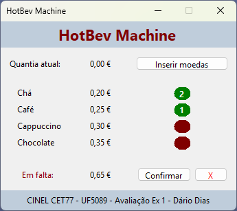
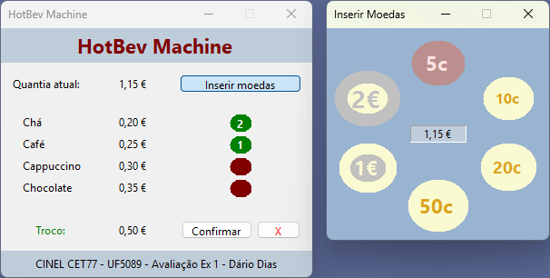
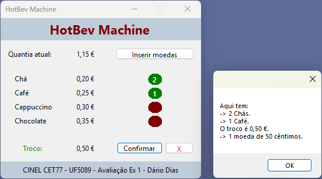

# ☕ HotBev Machine

A simple desktop application that simulates a **hot beverage vending
machine**, built with **C# Windows Forms**.

This is one of two evaluation projects from a professional training course module on WinForms.

This app allows users to:

- Select beverages
- Insert coins
- View total cost and change
- Confirm or cancel orders

---

## 📸 Screenshots

### Main Interface

### Insert Coins Window

### Order Completed & Change

---

## 🚀 Features

-   🥤 Select up to **5 beverages per order**
-   💰 Insert coins (5c, 10c, 20c, 50c, 1€, 2€)
-   🔢 Real-time calculation of:
    -   Total cost
    -   Inserted amount
    -   Remaining balance or change
-   🔄 Automatic **change calculation**
-   ❌ Cancel order and get **exact coin refund**
-   🪟 Separate window for coin insertion

---

## 🧠 How It Works

The application is mainly built using two forms:

### 🧾 `Form1` --- Main Machine Logic

Handles: - Beverage selection - Cost calculation - Change calculation -
Order confirmation - Reset and refund logic

Key responsibilities:

- Tracks total cost (`_custo`)
- Tracks inserted money (`Quantia`)
- Calculates change (`_troco`)
- Displays feedback to the user

---

### 💰 `FormInserirMoedas` --- Coin Insertion

Handles:

- Coin input via buttons
- Updates inserted amount in real time
- Communicates with `Form1`

Key features:

- Prevents inserting more than **2€**
- Tracks inserted coins for refunds
- Updates main form using:
- `Quantizar()` → updates money
- `Destrocar()` → recalculates change

---

## 🧩 Supported Beverages

Beverage       | Price   
-------------- | ------- 
Chá (tea)      | €0.20   
Café (coffe)   | €0.25   
Cappuccino     | €0.30   
Chocolate      | €0.35   

---

## 💸 Coin System

Supported coins:
- 2 €
- 1 €
- 50 cent
- 20 cent
- 10 cent
- 5 cent

### Rules:

-   Maximum inserted amount: **2€**
-   Change is returned using the **minimum number of coins**

---

## 🔄 Example Flow

1.  Select one or more beverages
2.  Open the "Insert Coins" window
3.  Insert coins until enough balance is reached
4.  Confirm the order
5.  Receive:
    -   Your beverages ☕
    -   Your change 💰

---

## 🛠️ Technologies Used

-   **C#**
-   **.NET Windows Forms**
-   Event-driven programming

---

## 📂 Project Structure

    HotBevMachine/
    │
    ├── Form1.cs                # Main application logic
    ├── FormInserirMoedas.cs    # Coin insertion form
    ├── RoundButton.cs          # Custom control for coin display
    └── README.md
